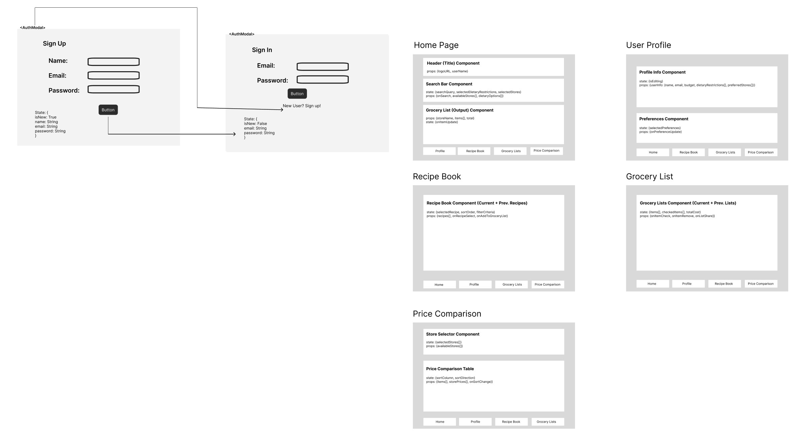

# Welcome to the Chop N' Shop Frontend!
This is prototype fullstack application for Chop N' Shop, our grocery shopping assistant. We integrated several of our **FastAPI** endpoints with our **MongoDB** database and Frontend components. This prototype will allow you to register a new user, authenticate an existing user, and retrieve a recipe.

This project communicates with a FastAPI API for its backend, and the relevant routes it accesses are documented in the README- https://github.com/dimash-web/chop-n-shop-database/blob/main/README.md of our backend repository.

## Setting Up & Running Instructions

### Frontend Setup
#### 1. Clone the Frontend Repository
```
https://github.com/Sreya-Mandalika/chop-n-shop-frontend.git
cd chop-n-shop-frontend
```
#### 2. Install Frontend Dependencies
Navigate to the project directory and install the necessary dependencies using npm:
```
npm install

```
#### 3. Run the Frontend
```
npm start
```
This will start the React development server and the frontend will be available at http://localhost:3000.

#### 4. Connecting with the backend
Please start the backend api (https://github.com/gunjan2713/Chop-n-shop-backend) and make sure to follow the setup instructions to make sure its running simultaneously with the frontend.

---------------------------------------------


# Chop-N-Shop Frontend

## Overview

We worked on developing an inital draft of our React app frontend to showcase Chop N' Shop, our grocery shopping assistant. We incorporated several interactive components related to price comparisons and recipe and list creation. A user can input their budget, dietary preferences, and any wanted items/recipes to create a grocery list for the week.

## Components
1. **Data Display**
   - Contains mock data (to be replaced with data from our database) that is displayed in the prototype.
3. **Header**
   - Contains the name of our product and a welcome message for the user to display at the top of every page.
5. **Grocery List**
   - Displays a list of past shopping trips, showing the date, stores visited, and total spending for each trip. It also provides a "View Details" button for further actions.
7. **Home**
   - Features a welcome banner, a section for managing the current shopping list, quick action buttons for tasks like price comparison and recipe browsing, and a "Recent Activity" section showing recent actions such as created lists and saved recipes.
9. **Navigation**
    - Provides buttons for navigating between different pages such as Home, Profile, Grocery Lists, Recipes, and Price Comparison. It also highlights the current page and provides icons and labels for each option.
11. **Price Comparison**
    - Compares the prices of grocery lists or individual products across multiple stores. It allows the user to choose between comparing a whole grocery list or a specific product, and displays the total prices or prices for each store, highlighting the cheapest option.
13. **Profile**
    - Displays a user’s information, including their dietary restrictions and allergies. It allows users to manage their dietary preferences and allergies, add/remove restrictions, and track favorite stores and saved recipes.
15. **Recipes**
    - Displays a collection of recipes, allowing users to search for recipes by name. It shows the ingredients, preparation time, and nutrition information, and includes an option to save the recipes.
17. **Search Bar**
    - Enables users to search for items by name, with a live search functionality. It also allows users to filter search results by store, displaying relevant options based on available stores.

## Development Process

### Design Decisions:
- We designed modular components that were consistent across the pages in our Figma wireframes. Using Figma for this made the collaboration process flow smoother.
- We integrated real life data to make the prototype reflect our future application.
- We also decided to create a simple layout, with descriptions on each page to make the application intuitive for the users. We will continue to research user preferences to implement them in our application.

### Technical Choices:  
- **React.js Framework:** React.js is used for its component-based architecture, efficient state management, and ability to dynamically update the UI, making it ideal for building interactive and responsive web applications. Its flexibility, performance optimizations makes it perfect for our project. 

- **Tailwind CSS for Styling:** Tailwind CSS was used for styling to simplify the design process with utility classes, enabling the creation of responsive and consistent layouts without the need for custom CSS.

## Site Map

`/home` - Home page   
`/profile` - Profile of the User   
`/grocery-list` - Grocery lists page, create new, add items   
`/recipe-book` - Recipe page, search recipe, save for later   
`/price-comparison` - Price Comparison page, compares price of an individual item, compares price for the whole grocery list

## WireFrame


## AI Usage

**Perplexity Integration:** Perplexity was specifically used to generate code for the layout, providing guidance on structuring and aligning components effectively. It also helped with the tailwind CSS.    

**Mock Data Generation:** AI assistance was used to create mock data that simulates API responses.
